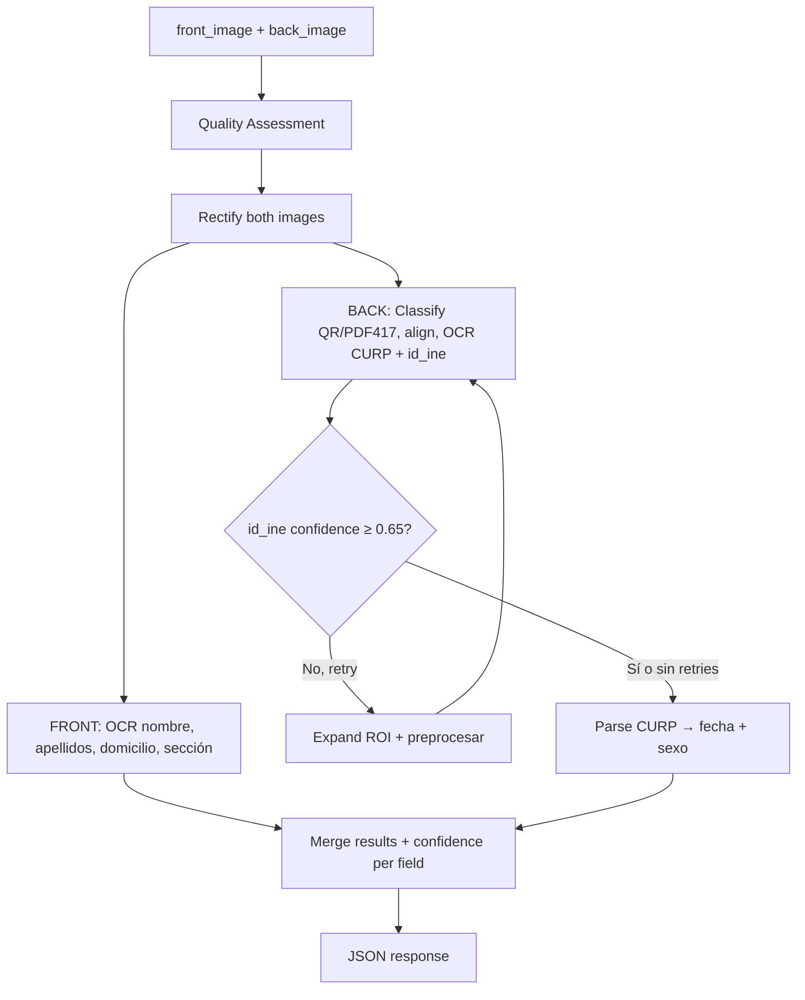

# OCR INE Python Service — Plan de Implementación

> Basado en [OCR_INE_SPEC.md](./OCR_INE_SPEC.md) — Alcance ampliado: extracción de **todos** los campos del formulario.

## Campos a Extraer (11 total)

| Campo | Fuente INE | Técnica |
|-------|-----------|---------|
| `nombre` | Frente | OCR región nombre |
| `apellido_paterno` | Frente | OCR región apellidos |
| `apellido_materno` | Frente | OCR región apellidos |
| `curp` | Reverso | OCR + regex 18 chars |
| `fecha_nacimiento` | CURP | Parse posiciones 5-10 |
| `sexo` | CURP | Parse posición 11 (H/M) |
| `id_ine` | Reverso | OCR MRZ/IDMEX |
| `domicilio.calle` | Frente | OCR región domicilio |
| `domicilio.colonia` | Frente | OCR región domicilio |
| `domicilio.codigo_postal` | Frente | OCR / parse domicilio |
| `domicilio.seccional` | Frente | OCR "SECCIÓN" (4 dígitos) |

---

## Estructura `/OCR_INE`

```
OCR_INE/
├── app/
│   ├── main.py              # FastAPI → POST /v1/ine/extract
│   ├── config.py             # Settings (env vars)
│   ├── models.py             # Pydantic schemas
│   ├── pipeline.py           # Orquestador front + back
│   ├── classifier.py         # Tipifica reverso: QR vs PDF417
│   ├── rectifier.py          # warpPerspective + deskew
│   ├── aligner.py            # Alineación por feature bbox
│   ├── extractor.py          # Tesseract OCR base
│   ├── front_parser.py       # Nombre, domicilio, sección
│   ├── back_parser.py        # CURP, id_ine
│   ├── curp_utils.py         # Validación + derivar fecha/sexo
│   ├── quality.py            # Blur, glare, exposure
│   ├── confidence.py         # Score por campo
│   └── templates/
│       └── roi_templates.json
├── tests/
├── Dockerfile
├── requirements.txt
└── README.md
```

---

## Pipeline



---

## Response (compatible con frontend existente)

```json
{
  "model_id": "MODEL_QRHD_2019_PRESENT",
  "beneficiarios": {
    "nombre": { "value": "JUAN", "confidence": 0.91 },
    "apellido_paterno": { "value": "PEREZ", "confidence": 0.89 },
    "apellido_materno": { "value": "LOPEZ", "confidence": 0.87 },
    "curp": { "value": "PELJ000101HDFRPNA1", "confidence": 0.95 },
    "fecha_nacimiento": { "value": "2000-01-01", "confidence": 0.95 },
    "sexo": { "value": "M", "confidence": 0.95 },
    "id_ine": { "value": "ABC123...", "confidence": 0.84 }
  },
  "domicilio": {
    "calle": { "value": "AV REFORMA 100", "confidence": 0.72 },
    "colonia": { "value": "CENTRO", "confidence": 0.70 },
    "codigo_postal": { "value": "06600", "confidence": 0.80 },
    "seccional": { "value": "0234", "confidence": 0.93 }
  },
  "quality": { "front": { "quality_grade": "good" }, "back": { "quality_grade": "good" } },
  "warnings": [],
  "processing_ms": 5200,
  "attempts": 2
}
```

---

## Dependencias

| Paquete | Uso |
|---------|-----|
| `fastapi` + `uvicorn` | API HTTP |
| `opencv-python-headless` | QR/PDF417 detection, warpPerspective |
| `pytesseract` | OCR |
| `Pillow` | Decodificación imágenes |
| `pydantic-settings` | Config por env vars |

**Sistema**: `tesseract-ocr` + `tesseract-ocr-spa`

---

## Ejecución

```bash
# Desarrollo local
cd OCR_INE
pip install -r requirements.txt
uvicorn app.main:app --port 8001

# Docker
docker build -t ocr-ine .
docker run -p 8001:8001 ocr-ine

# Laravel .env
OCR_INE_SERVICE_URL=http://localhost:8001
OCR_INE_API_KEY=tu-api-key
```
